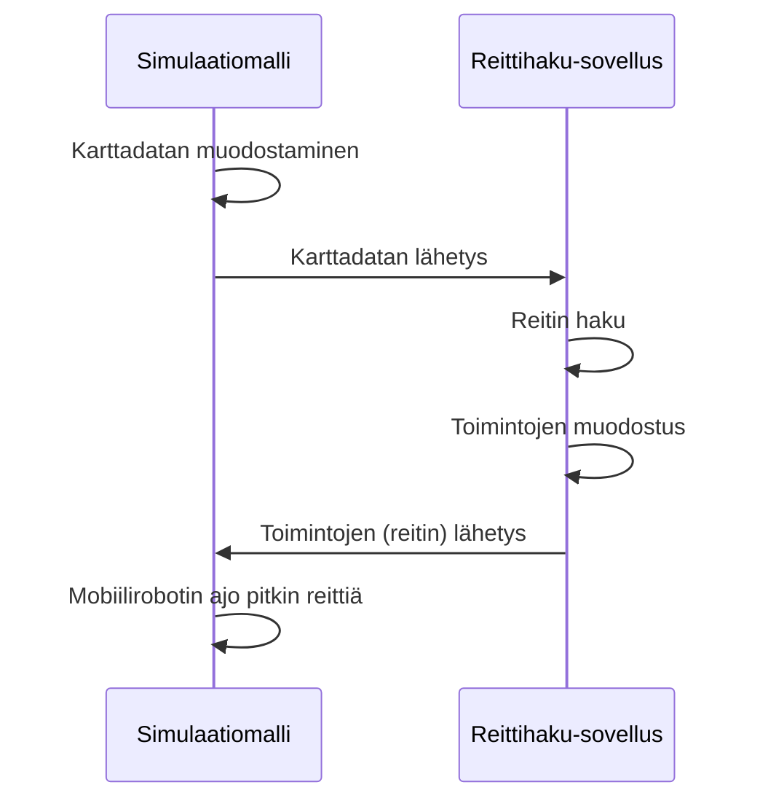

[](https://zenodo.org/doi/10.5281/zenodo.10134440)


# OPLITE - Vahvistusoppiminen

## Vahvistusoppiminen

Vahvistusoppiminen (engl. reinforcement learning) on koneoppimisen ongelmanratkaisutekniikka, jossa agentti tutkii ympäristöä, jonka tilan se havaitsee, ja toimii sen mukaisesti. Ympäristö antaa toiminnan mukaan palautetta, joka voi olla positiivista tai negatiivista. Algoritmi pyrkii löytämään ongelmaan ratkaisun, joka tuottaa eniten positiivista palautetta. Lähde: [https://fi.wikipedia.org/wiki/Vahvistusoppiminen](https://fi.wikipedia.org/wiki/Vahvistusoppiminen).

## Reittihaku-sovellus

Tämä sovellus käyttää vahvistusoppimista löytääkseen simulaatiomallissa liikkuvalle mobiilirobotille reitin läpi alueen, jolle käyttäjä voi asettaa esteitä ja siirtää niiden paikkaa.

Sovelluksen ja simulaatiomallin toiminta on esitetty alla olevassa sekvenssikaaviossa.



## Simulaatiomallit

Reittihaku-sovellus on suunniteltu toimimaan yhdessä seuraavien simulaatiomallien kanssa:
* OPLITE_Reinforcement_Learning_external.vcmx (Visual Components)
* oplite_reinforcement_learning_external.spp (Plant Simulation)

Alla olevat simulaatiomallit toimivat itsenäisesti ilman ulkoista reittihaku-sovellusta. Niitä voi käyttää, jos tietokoneelle ei ole asennettu Python-ohjelmointikieltä tai jos simulaatiomallin ja ulkoisen sovelluksen välisessä yhteydessä on jotain ongelmaa.
* OPLITE_Reinforcement_Learning_python2.vcmx (Visual Components)
* oplite_reinforcement_learning_simtalk.spp (Plant Simulation)

Kaikki simulaatiomallit löytyvät *sims*-kansiosta.

Huomaa, että Plant Simulation ja Visual Components vaativat maksullisen lisenssin toimiakseen.

## Reittihaku-sovelluksen käyttö

Käynnistä reittihaku-sovellus kirjoittamalla alla oleva teksti komentokehotteeseen:

```python
python app.py
```

Avaa sitten simulaatiomalli, aseta esteet ja käynnistä simulaatio. Kun reitti on löytynyt, mobiilirobotti liikkuu simulaatiomallissa reittihaun algoritmin löytämän reitin mukaisesti.

Jos haluat vaihtaa esteiden paikkaa, resetoi simulaatio, aseta esteiden sijainti ja käynnistä lopuksi simulaatio uudestaan.

## Sovelluksen toiminta

### Frozen Lake -ympäristö

Sovellus hyödyntää reittihaussa *gymnasium*-paketin *Frozen Lake* -ympäristöä:

[https://gymnasium.farama.org/environments/toy_text/frozen_lake/](https://gymnasium.farama.org/environments/toy_text/frozen_lake/)

Kyseisessä ympäristössä agentille on määritetty neljä mahdollista toimintoa:
* 0: liike vasemmalle
* 1: liike alas
* 2: liike oikealle
* 3: liike ylös

Palkkio on *Frozen Lake*-ympäristössä 1, jos agentti saavuttaa reitin loppupisteen, muussa tapauksessa 0.

### Karttadatan muodostaminen

Kaikissa simulaatiomalleissa on neliömäinen alue, jolla mobiilirobotti liikkuu. Käyttäjä voi asettaa tälle alueelle esteitä, joita mobiilirobotin tulee väistää matkallaan lähtöpisteestä loppupisteeseen. Mobiilirobotin kulkeman reitin lähtöpiste on alueen vasemmassa ylänurkassa, kun taas loppupiste on alueen oikeassa alanurkassa.

Alueen karttaa kuvataan merkkijonolla, joka koostuu kirjaimista *S*, *F*, *H* ja *G* siten, että
* *S* (start) on reitin alkupiste
* *F* (frozen) on piste, jossa ei ole estettä
* *H* (hole) on piste, jossa on este
* *G* (goal) on reitin loppupiste

Kirjaimet vastaavat Frozen Lake -ympäristön merkintätapaa.

Merkkijono muodostetaan alueen pisteistä lähtemällä liikkeelle reitin alkupisteestä eli vasemmasta ylänurkasta, josta liikutaan alaspäin rivi kerrallaan. Kukin rivi luetaan vasemmalta oikelle.

Esimerkiksi merkkijono

"SFHHFFFFFFFFFHFFFFFFFHFFFFFFFHFFFHHHFHFFFFFFFHFFFFHFFFFFFFHFFFFG"

kuvaa alla olevaa 8x8-aluetta.


**Kuvio 1.** Karttaesimerkki.

### Karttadatan lähetys

Simulaatiomalli lähettää karttadatan, alueen koon ja simulaatio-ohjelman lyhenteen (ps = Plant Simulation, vc = Visual Components) reittihaku-sovelluksessa olevalle palvelin-pistokkeelle. Alla on esimerkki Plant Simulation -ohjelman lähettämästä viestistä.
```
{"mapdata": "SFFFFHHFFHFFFFFG", "mapsize": 4, "simsoft": "ps"}
```

### Reittihaun algoritmi

Reittihaun algoritmi koostuu kahdesta vaiheesta. Aluksi päivitetään Q-taulu, jonka avulla saadaan selville ne toiminnot, joiden avulla mobiilirobotti pääse alkupisteestä loppupisteeseen kulkien pitkin algoritmin löytämää reittiä.

Q-taulun päivityksen pseudokoodi:


Reitin toimintojen määrityksen pseudokoodi:


Kuviossa 2 on esitetty vihreällä taustavärillä eräs ratkaisu, jolla agentti pääsee alkupisteestä loppupisteeseen.


**Kuvio 2.** Ratkaisu.

Ratkaisu annetaan toimintojen listana, joka on tässä esimerkkitapauksessa:

[1, 2, 1, 2, 2, 1, 2, 1, 1, 1, 1, 2, 2, 2]

### Q-taulu

Reittihaun algoritmissa käytetään Q-taulua, jossa pidetään kirjaa kunkin tilan eri toiminnoista saaduista palkkioista. Q-taulu on käytännössä matriisi, jonka rivien lukumäärä vastaa tilojen lukumäärää ja sarakkeiden lukumäärä vastaa toimintojen lukumäärää.

Q-taulu alustetaan nollaksi ennen algoritmin ajoa (taulukko 1).

**Taulukko 1.** Q-taulu.


Q-taulu päivitetään alla olevan yhtälön mukaisesti:


missä
* *s* on tila (engl. state)
* *a* on toiminto (engl. action)
* *t* on ajan hetki (engl. time)
* *α* on oppimisnopeus (engl. learning rate)
* *r* on palkkio (engl. reward)
* *γ* on alennustekijä (engl. discount factor)

Oppimisnopeus (0 < 𝛼 ≤ 1) määrittää missä määrin uusi tieto peittoaa vanhan tiedon. Jos oppimisnopeus on 0, agentti ei opi mitään. Jos taas oppimisnopeus on 1, agentti hylkää vanhan tiedon ja käyttää vain uutta tietoa. Oppimisnopeudelle käytetään usein jotain vakioarvoa.

Alennustekijä *γ* määrittää miten tärkeä tuleva palkkio on. Arvo 0 saa agentin tavoittelemaan vain nykyistä palkkiota, kun taas alennustekijä, joka lähestyy arvoa 1, saa agentin tavoittelemaan pitkän aikavälin palkkiota.

### Reitin lähetys

Sovellus lähettää algoritmin löytämän ratkaisun simulaatio-ohjelmalle. Viesti koostuu toiminnoista, jotka on erotettu pilkulla toisistaan.

### Reitin visualisointi

Lopuksi simulaatio-ohjelma visualisoi mobiilirobotin reitin, kun toiminnot on vastaanotettu reittihaku-sovellukselta.

## Tekijätiedot

Hannu Hakalahti, Asiantuntija TKI, Seinäjoen ammattikorkeakoulu

## Hanketiedot

* Hankkeen nimi: OPLITE - Optimaalista lisäarvoa teknologiasta
* Rahoittaja: Etelä-Pohjanmaan liitto
* Aikataulu: 1.1.2023 - 31.12.2025
* Hankkeen kotisivut: [https://projektit.seamk.fi/alykkaat-teknologiat/oplite/](https://projektit.seamk.fi/alykkaat-teknologiat/oplite/)
---


